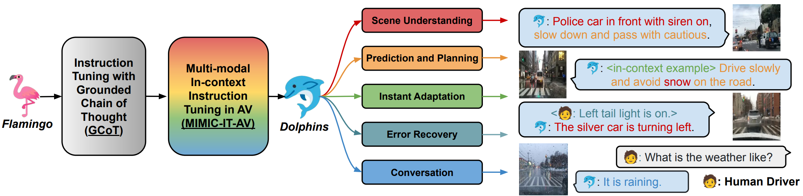

# :dolphin: Dolphins: Multimodal Language Model for Driving


<div align="center">

[[Website]](https://vlm-driver.github.io/)
[[Arxiv]](https://arxiv.org/abs/2312.00438)
[[PDF]](assets/documents/demo_paper.pdf)
[[Demo]](https://youtu.be/pJAdZKySgLg?si=y7Z-j4zLuFRSzTYH)

[](https://github.com/gray311/Dolphins/)
[](https://github.com/gray311/Dolphins/blob/main/LICENSE)
______________________________________________________________________

https://github.com/gray311/Dolphins/assets/64787301/04f84fcd-9d70-4be1-86f0-2d619e7df0c4

</div>


## 📖 Overview

The quest for fully autonomous vehicles (AVs) capable of navigating complex real-world scenarios with human-like understanding and responsiveness. In this paper, we introduce **Dolphins**, a novel vision-language model architected to imbibe human-like driving abilities. **Dolphins** is adept at processing multimodal inputs comprising video (or image) data, text instructions, and historical control signals to generate informed outputs corresponding to the provided instructions. Building upon the open-sourced pretrained Vision-Language Model, OpenFlamingo, we tailored **Dolphins** to the driving domain by constructing driving-specific instruction data and conducting instruction tuning. Through the utilization of the BDD-X dataset, we designed and consolidated four distinct AV tasks into **Dolphins** to foster a holistic understanding of intricate driving scenarios. As a result, the distinctive features of **Dolphins** are delineated into two dimensions: **(1)** the ability to provide a comprehensive understanding of complex and long-tailed open-world driving scenarios and solve a spectrum of AV tasks, and **(2)** the emergence of human-like capabilities including gradient-free rapid learning and adaptation via in-context learning, reflection and error recovery, and interoperability.

In this repo, we provide **Dolphins** code. This codebase is under [MIT License](LICENSE).




## :fire: News 

* **[TBD]** We will soon release our code, model weight, dataset, and benchmark.
* **[2023.12.3]** We release the [paper](https://arxiv.org/abs/2312.00438) and the [webpage](https://vlm-driver.github.io/) of our project.

## 📑 Paper and Citation

If you find our work useful, please consider citing us!

```
@misc{ma2023dolphins,
      title={Dolphins: Multimodal Language Model for Driving}, 
      author={Yingzi Ma and Yulong Cao and Jiachen Sun and Marco Pavone and Chaowei Xiao},
      year={2023},
      eprint={2312.00438},
      archivePrefix={arXiv},
      primaryClass={cs.CV}
}
```

## 💝 Acknowledgements

We thank the [OpenFlamingo](https://github.com/mlfoundations/open_flamingo) team and [Otter](https://github.com/Luodian/Otter) team for their great contribution to the open-source community.


